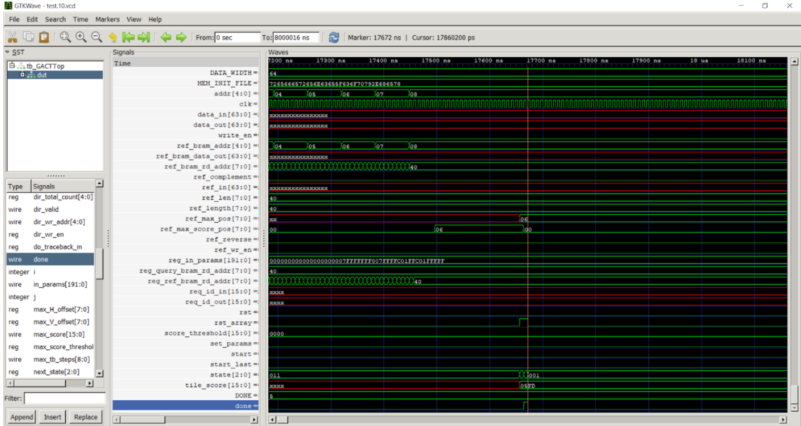

## Hardware Implementation and Baseline Evaluations

#### System Requirements
1. Python 3
2. Icarus Verilog
3. GTKWave

#### Clone DP-HLS Repository
Cloning DP-HLS clones the baseline repositories required (see Baseline Tools section)
```
git clone --recursive https://github.com/TurakhiaLab/DP-HLS.git
cd DP-HLS/baseline/hardware
```

#### Running the Baseline
To get the throughput metric for GACT, run the following:
```
cd darwin/RTL/GACT
iverilog -o tb_GACTTop tb_GACTTop.v GACTTop.v BRAM.v FIFOWithCount.v SmithWatermanArray.v SmithWatermanPE.v Ascii2Nt.v BTLogic.v DP_BRAM.v Nt2Param.v mux_1OfN.v 
vvp tb_GACTTop
gtkwave -f test.10.vcd
```
This should bring up a digital waveform interface similar to this:

Add all tb_GACTTop associated signals by clicking on the drop down button in the top left panel, then click dut. This should bring up all the dut signals used in the simulation in the bottom right panel. Add all of the signals by selecting them all, right clicking, select recurse Input, then append. This brings up the waveforms shown in the middle of the screen. To calculate the throughput for a single alignment, navigate to the point where the done signal is high (shown at the bottom of the screenshot above). The time point shown at the top of the page represents the latency for the completion of a single alignment in the PbSim2 dataset. Hence, the throughput will be in terms of 1 alignment per $n$ nanoseconds, where $n$ is the latency shown on the screen. To get the complete throughput in terms of alignments/second, simply multiply by $10^9$ ns / $1$ s to convert the units accordingly. 

To get the throughput metric for BSW, run the following:
```
cd Darwin-WGA/src/hdl/BSW
 iverilog -o tb_BSW_ArrayTop tb_BSW_ArrayTop.v BSW_Array.v BSW_ArrayTop.v BSW_AXISlave.v BSW_PE.v ../common/BRAM.v ../common/Ascii2Nt.v ../common/DP_BRAM.v ../common/FIFO.v ../common/Nt2Param.v
vvp tb_BSW_ArrayTop
gtkwave -f test.10.vcd
```
This should bring up a waveform similar to the one displayed previously. Following the same steps as above, navigating to where the done signal is high and converting the units to get the throughput value in terms of alignments per second for the PbSim2 data set.

#### Baseline Tools
We have used [GACT](https://github.com/yatisht/darwin/tree/master), [BSW](https://github.com/gsneha26/Darwin-WGA), and [SquiggleFilter](https://github.com/TimD1/SquiggleFilter) as our baselines. Cloning the repository above will clone GACT, BSW, and SquiggleFilter repositories, including their RTL code.
